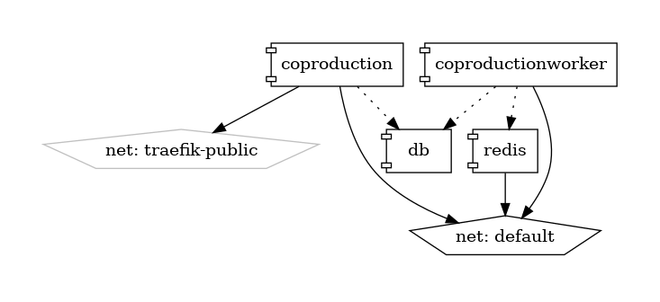
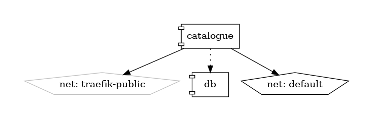
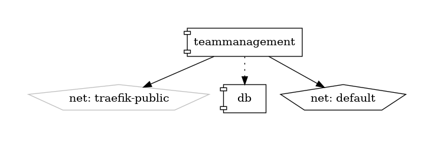
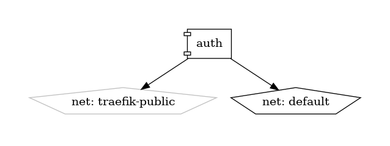

## Docker diagrams
### Coproduction





## Microservices
### Data
* **db**: PostgreSQL database.
* **redis**: as message broker for coproduction and coproductionworker microservices

### Logic

* **auth**: 
  * Docs: http://localhost/auth/docs
  * Models: none
  * Dependencies: **db** running

* **teammanagement**: 
  * Docs: http://localhost/users/docs
  * Models: *teams, memberships*
  * Dependencies: **db** running

* **catalogue**:
  * Docs: http://localhost/catalogue/docs
  * Models: artefact, interlinker, publicservice, rating, questioncomment, functionality, problemdomain
  * Dependencies: **db** running

* **coproduction**:
  * Docs: http://localhost/coproduction/docs
  * Models: asset, task, taskinstantiation, phase, phaseinstantiation, objective, objectiveinstantiation, coproductionprocess, coproductionschema
  * Dependencies: **catalogue** running, **redis** running

* **coproductionworker**: uses **Celery**, a task queue implementation for Python web applications used to asynchronously execute work outside the HTTP request-response cycle. This service can import and use models and code from the rest of the coproduction microservice selectively to run repetetive or concurrent tasks.
  * https://medium.com/swlh/python-developers-celery-is-a-must-learn-technology-heres-how-to-get-started-578f5d63fab3


## Routing

As you can see in the *interlinkers.docker-compose.override.yml*, traefik (**proxy** microservice) routes all containers that specify the traefik tag. For example, redirects all traffic with "/filemanager" prefix to the port where filemanager interlinker is running. This allows to integrate new interlinkers in a very easy way.

```
labels:
  - traefik.enable=true
  - traefik.http.routers.${STACK_NAME}-forum-http.rule=PathPrefix(`/forum`)
  - traefik.http.services.${STACK_NAME}-forum.loadbalancer.server.port=${FORUM_PORT}
```

## Proxy (proxy.docker-compose.yml)

* **proxy**: Load balancing and reverse proxy with **Traefik** (http://localhost:8090/dashboard/). 

  
