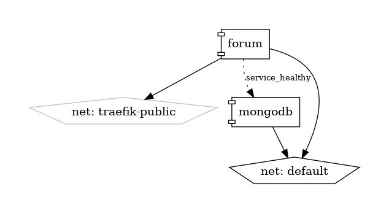
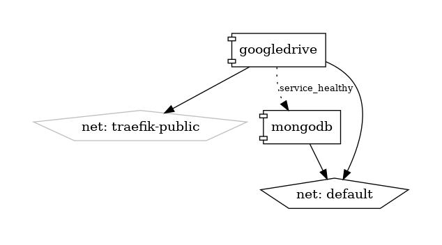

## Interlinkers (interlinkers.docker-compose.yml)
This project is intended to sum up the different interlinkers developed for the project. But, ¿what is an interlinker?

An *interlinker* is a tool that is used to create assets by *instantiating* them. These interlinkers can be classified by its *nature*: **software** or **knowledge**.

* **Software interlinkers** are software based interlinkers. For example, **forum** interlinker can be instantiated to create a forum where users can create channels and send messages. 

* **Knowledge interlinkers** refer to text, slide, spreadsheet or other type of document **templates**, made by someone, that can be "cloned" to be modified. They use one of the file backends available, such as **googledrive** or **filemanager**. 

### Regarding software interlinkers... how are they integrated? are all them built with the same technologies?

No. Each interlinker is treated as an independent component, so they can be developed with any framework or tool (MEAN, MERN, django, NextJS... the possibilities are infinite). **The only restriction is to implement an API structure like this:**

## API structure

1. **Create new asset:** POST /*interlinker_name*/api/v1/assets/

Accepts specific data and authorization data

1. **Get existing asset:** GET /*interlinker_name*/api/v1/assets/{id}
1. **Update existing asset:** PUT /*interlinker_name*/api/v1/assets/{id}
1. **Delete existing asset:** DELETE /*interlinker_name*/api/v1/assets/{id}
1. **Clone existing asset:** POST /*interlinker_name*/api/v1/assets/{id}/clone
1. **Show interlinker GUI for specified asset:** GET /*interlinker_name*/api/v1/assets/{id}/gui

Ideally, these interlinkers have to expose an specifically structured API, which runs business logic for their operation and a user interface that will be integrated through iframes in the main frontend.

### Interlinkers list:

#### Forum

  * Functionality: allows users to create channels and send messages through them. 
  * Asset meaning: *forum room* where channels can be created.
  * Docker-compose diagram:

  * GUI demo ( /forum/api/v1/assets/{id}/gui ):

    

    And its integration in the main frontend with an iframe:

    

  * Docs: http://localhost/forum/docs

#### Googledrive

  * Functionality: stores files in Google Drive.
  * Asset meaning: *file* stored in Google Drive. Can be word, slides or spreadsheet
  * Docs: http://localhost/googledrive/docs

#### Filemanager
  * Functionality: stores files in AWS S3 (currently in file system for simplicity).
  * Asset meaning: *file* stored in file directory (in future file in AWS S3 buckets)
  * Docs: http://localhost/filemanager/docs

#### Voting tool (NOT IMPLEMENTED YET):
  * Functionality: allows users to vote. 
  * Asset meaning: *voting* where users can vote for an option.
  * GUI demo:
  * Docs: 

#### Gitmanager (NOT IMPLEMENTED YET):

  * Functionality: stores files in github repositories, being able to see versions (commits) and the diffs.
  * Asset meaning: GitHub repository.
  * Docs: 