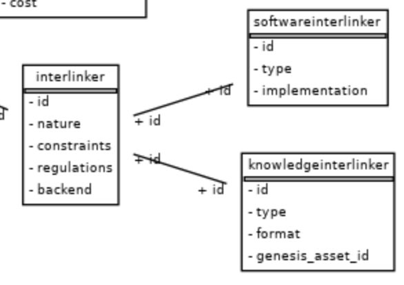
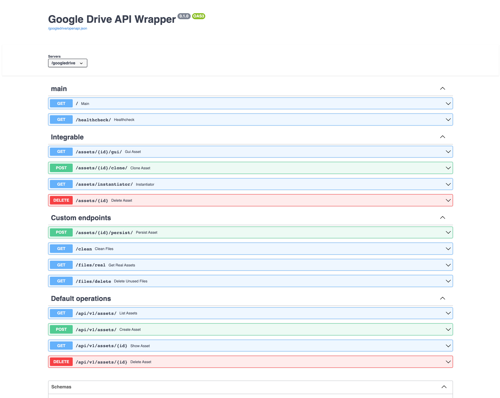
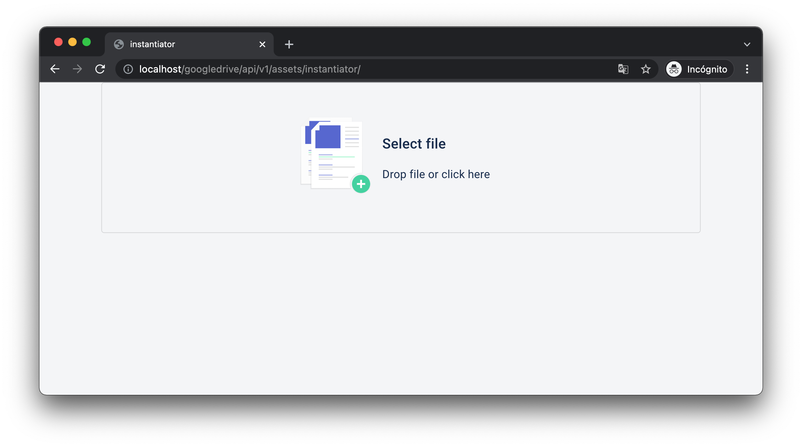

## Interlinkers integration
This project is intended to sum up the different interlinkers developed for the project. But, ¿what is an interlinker?

An *interlinker* is a tool that is used to create assets by *instantiating* them. These interlinkers can be classified by its *nature*: **software** or **knowledge**.

* **Software interlinkers**:

  Are software based interlinkers that create assets. For example, **forum** interlinker can be instantiated to create a forum where users can create channels and send messages. This "forum instance" is called an "asset". 

* **Knowledge interlinkers**:
  
  Refer to assets made by users that can be used as templates. For example, an user can create a google drive word document using **googledrive** interlinker and add some text to it. Now, this document could be reused, as if it was a template. 

  A knowledge interlinker points to the software interlinker used to create an asset (softwareinterlinker_id) and the id of the specific asset that should be treated as the template (genesis_asset_id). 

  

  This allows us to create knowledge interlinkers based on any software interlinker (with some conditions, as it is going to be explained later):

    * Survey: create survey templates for specific aspects that users could reuse (such us "Survey for interlinker quality assurance")
    * Googledrive: (google apps) create document, slides or sheet templates
    * Etherpad: create document templates

    ...

## API Endpoints needed for SOFTWARE INTERLINKERS integration

Each interlinker is treated as an independent component, so they can be developed with any framework or tool (MEAN, MERN, django, NextJS... the possibilities are infinite). But they all need to expose these endpoints to integrate them: 

1. **GUI for asset instantiation:** GET 

    * **WHAT:** basic GUI por asset instantiation. This is gonna be iframed.
    * **Method:** GET
    * **URL:** /*interlinker_name*/assets/instantiator/
    * Messages for the main frontend integration:
      * When initialized, send a message to the parent like { 'code': 'initialized', } 
      * When asset created, send a message to the parent like { 'code': 'asset_created', 'message': data of the asset }
    * Examples:
      * googledrive interlinker: file input
      * survey: form drag and drop creator
      * etherpad: text input for specifying a name

2. **GUI for given asset:** 

    * **WHAT:** shows GUI for given asset.
    * **Method:** GET
    * **URL:** /*interlinker_name*/assets/{id}/gui/
    * Examples:
      * googledrive interlinker: redirects to Google Drive domain where document is located (for example https://docs.google.com/document/d/{id}/edit)
      * forum: renders GUI developed with react
      * etherpad: renders an iframe that shows etherpad GUI running in a diferent location (such as /etherpad/p/{padID})

3. **Delete existing asset:** 

    * **WHAT:** deletes assets by id
    * **Method:** DELETE
    * **URL:** /*interlinker_name*/assets/{id}

4. [OPTIONAL] **Clones asset:** 

    * **WHAT:** clones asset given an id.
    * **Method:** POST
    * **URL:** /*interlinker_name*/assets/{id}/clone/

> :warning: If /clone/ not specified, the interlinker could not be used to generate knowledge interlinkers.
  
Furthermore, interlinkers can implement any other endpoints needed for its functionality. For example, Googledrive interlinker implements:

## Example flow with Googledrive interlinker

VIDEO: https://youtu.be/N3jB3lwOsRo
1. **Asset instantiator:**  /googledrive/assets/instantiator/

Renders a file input that has a listener attached:

When users selects a file, a POST request to /api/v1/assets/ **OF THE INTERLINKER** (in this case /googledrive/api/v1/assets/) is made with the data needed for the asset instantiation (in this case, the file). When response received, a message to the parent is sent with the asset data:

When the **Collaborative Environment frontend** receives the message, makes a POST request to /coproduction/api/v1/assets/ to store that asset for the task where the user has pressed "Add asset" button.

