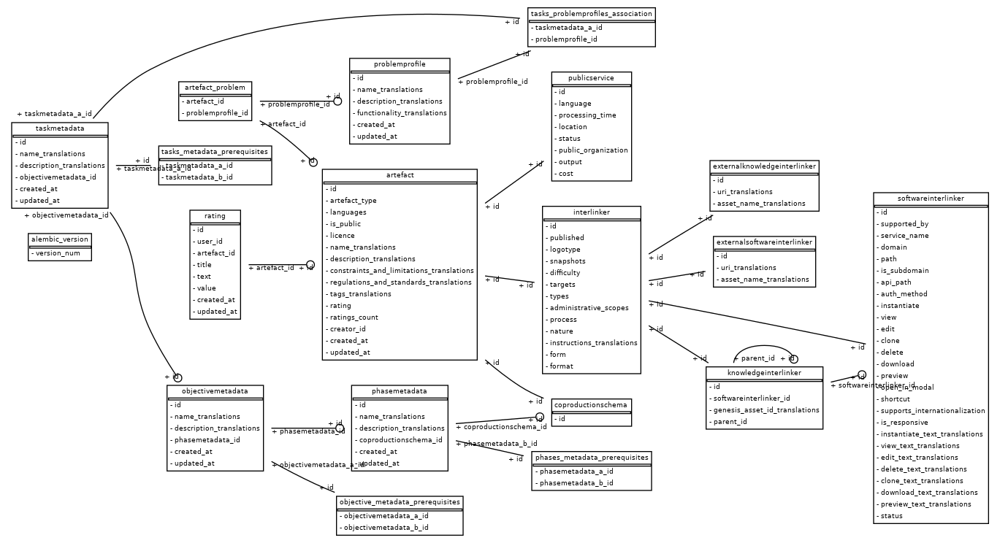
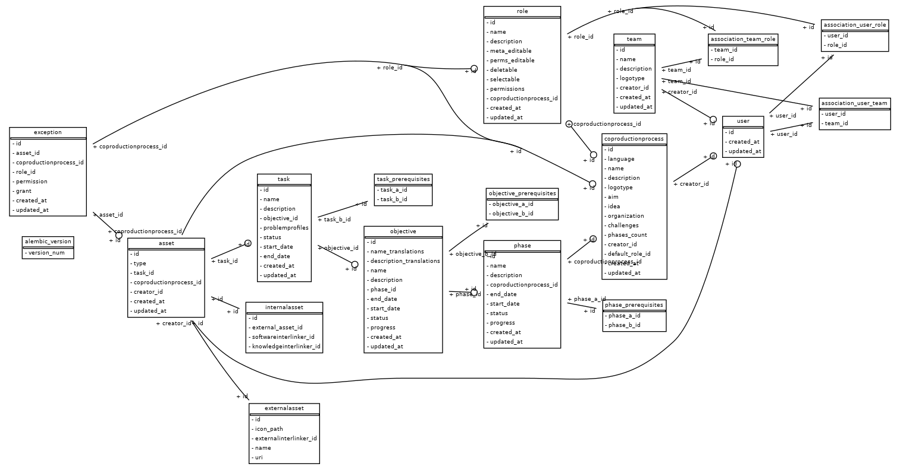

# Data models

## Current data models of the main components of the collaborative environment backend

### Catalogue service


### Coproduction service


## Migrations on the data models

### Current migration files for each component
* CATALOGUE: https://github.com/interlink-project/backend-catalogue/tree/master/catalogue/alembic/versions
* COPRODUCTION: https://github.com/interlink-project/backend-catalogue/tree/master/coproduction/alembic/versions


### How to create new migration files

```sh
cd backend-coproduction
make migration message="Migration message"
# a new migration file will be created -> change it if needed
make applymigrations
```

In case that changes are made to the data model, the migration files should implement the migration of the data. For that, take this into account:

https://stackoverflow.com/questions/24612395/how-do-i-execute-inserts-and-updates-in-an-alembic-upgrade-script


