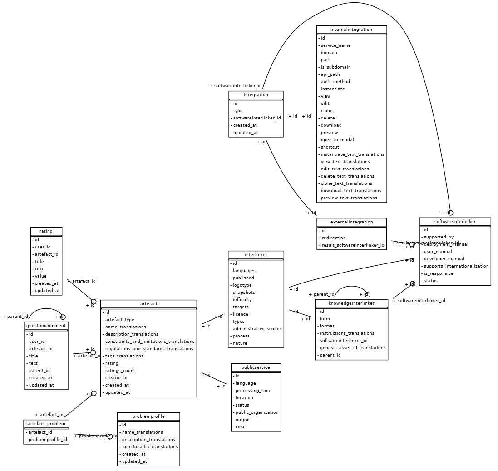
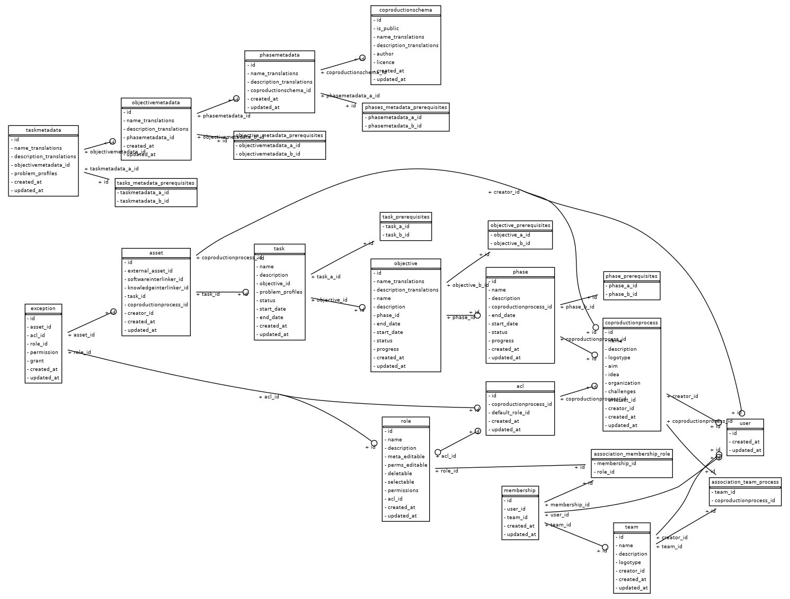

# Data models

Migrations
https://stackoverflow.com/questions/24612395/how-do-i-execute-inserts-and-updates-in-an-alembic-upgrade-script

https://github.com/interlink-project/backend-catalogue/tree/master/catalogue/alembic/versions
https://github.com/interlink-project/backend-catalogue/tree/master/coproduction/alembic/versions

