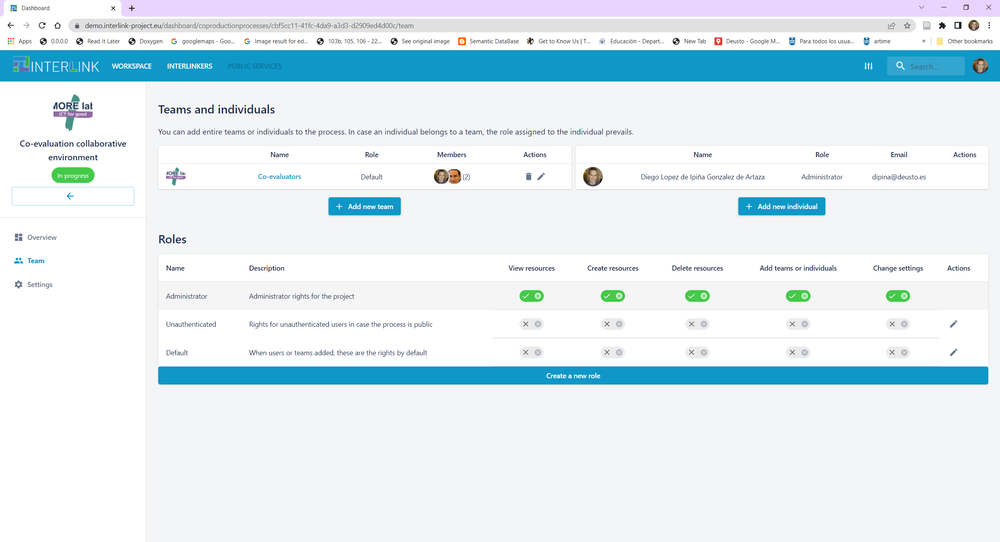
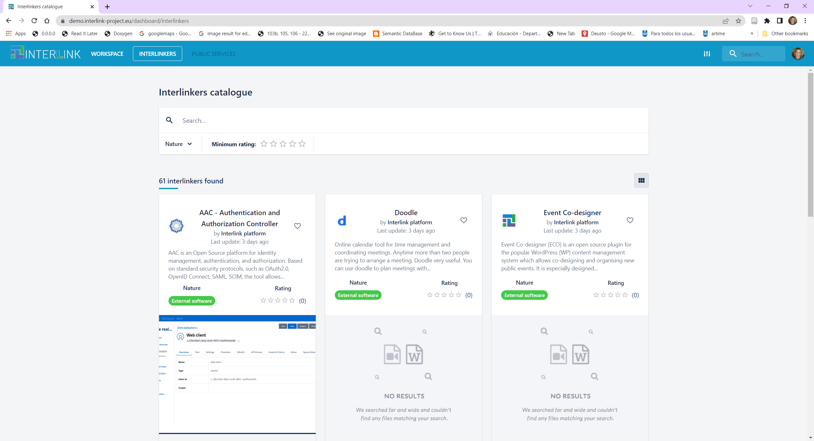

# User Acceptance testing

<dl>
  <dt>Acceptance Testing</dt>
  <dd>This is a type of testing done by users, customers, or other authorised entities to determine application/software needs and business processes. Acceptance testing is the most important phase of testing as this decides whether the client approves the application/software or not.</dd>
</dl>

<dl>
  <dt>User Acceptance Testing (UAT)</dt>
  <dd>UAT is a type of testing performed by the end user or the client to verify/accept the software system before moving the software application to the production environment. UAT is done in the final phase of testing after functional, integration and system testing is done.</dd>
</dl>

This document ilustrates the different tests needed to ensure that the expected functionality, from the end-user's point of view, of the INTERLINK Collaborative Environment is met. The main Purpose of UAT is to validate end to end business flow. It does not focus on cosmetic errors, spelling mistakes or system testing. User Acceptance Testing is carried out in a separate testing environment with production-like data setup. It is kind of black box testing where two or more end-users will be involved. User acceptance testing is needed for **testing whether the final product is accepted by client/end-user**.

## Smoke Testing

The first section carries out a so-called *Smoke Testing*

<dl>
  <dt>Smoke Testing</dt>
  <dd>In computer programming and software testing, smoke testing is preliminary testing to reveal simple failures severe enough to, for example, reject a prospective software release.</dd>

  <dt>Staging server</dt>
  <dd>A server used to temporarily show certain users new and revised Internet and/or intranet pages before they are put into production.</dd>
</dl>

The following Smoke Testing should be applied over [INTERLINK's staging server](https://demo.interlink-project.eu/):

0. Before using the Collaborative environment, you must first login with your google credentials or create your own credentials at [https://demo.interlink-project.eu/](https://demo.interlink-project.eu/), i.e. the staging server of INTERLINK. **IMPORTANT**: All members of an envisaged team must logged into the platform before they can be added to a team.  
1. Create a team which wants to take part in a co-production process.    
2. Create a co-production project where the activity to co-create is assessed 
3. Link the created team to the created co-production process.  
3. Choose a co-production process guide (flexibility to choose the best fitting schema)
   - Notice that there are several co-production trees available. We will take the one named "Default schema" 
   - Beware of emergence of Guide view menu item on left hand side 
   - You may customize such tree to the specific needs of your co-production process. Currently only DELETE task allowed, soon we will be able to add new objectives & tasks. Check below how a task is removed after having clicked on the PENCIL icon which appears on the right hand side of the task visualization panel.
   
   
   - Observe that specific co-production trees can be defined and, hence, selected (e.g. VARAM case)
   - You may also assign durations to tasks
   
   - Then we can see in WORKPLAN view the time span defined, by clicking on the "Time planification" link in the GUIDE view or clicking on the left hand side menu option named "Workplan". You may return to the Workplan view, to see the task details by clicking on the name of the task in the WORKPLAN view. 
   
4. Create new roles and new teams with different rights than the core co-producers’ team. Currently a role applies to all phases, objectives and tasks of a co-production process. 
	- Create a new team 
	
	- Create a new role, assigning it the right to "View resources" only
	
	- Assign the role of co-observers to the co-observers team
	
5. Use the guide to co-produce SOMETHING, e.g. new document to collect feedback of collaboration process. For each of the tasks in the co-production phases you may select any of the recommended INTERLINKERs or instantiate a new one based on the generic software INTERLINKERs available at the bottom of the screen shown when selecting a co-production task. 
	- Select another task in the GUIDE view, e.g. ENGAGE > Engage Stakeholders > Create awareness and Communication
	- Notice the INTERLINKERs recommended
	
	- Select a task in the GUIDE view, e.g. ENGAGE > Define legal and ethical framework > Define a non-disclosure agreement (NDA)
	- Click on the blue button at the bottom entitled "Initiate Procedure" to give place to a new Google Docs document
	
	- Select the type of document to create with the support of Google Drive INTERLINKER
	
	- Realize about the new resource that appears at the bottom of the task description panel
	
	- Open it in Google Drive by clicking on the newly created resource name
	
6. Review progress of project in OVERVIEW
	
7. Check functionality of the INTERLINK catalogue by clicking on INTERLINKERs, browsing, filtering and selecting INTERLINKERs.
	- Enter in the catalogue of INTERLINNKERs by clicking on INTERLINKERs top menu
	
	- Filter by selecting options on Nature filter
	
	- Review contents of an INTERLINKER by clicking on its title
	
	- You main review what it offers by visiting Preview tab
	
	
## Acceptance testing 

Next, we will illustrate how to perform a more exhaustive suite of manual tests that expore all currently available functionalities within the Collaborative Environment.

The steps to validate that the miminum functionalities to allow a collaborative process to be materialized are listed below:

0. **Ensure that team members have logged in at least once** at [INTERLINK's staging server](https://demo.interlink-project.eu/)
   - Ensure that two sessions at least are opened, e.g. one for user user1@deusto.es and another one for user user2@gmail.com, to be able to test the environment's collaborative features sensibly. 
1. **Create a team** *“INTERLINK co-production team for co-evaluation of collaborative environment”* which will jointly generate an assessment of the environment and its capabilities to carry out collaborative processes. Add at least 2 members to the team, e.g. user1@deusto.es and user2@gmail.com
2. **Create a co-production project**, namely *“Co-evaluation of the co-production process”*
3. **Go to Settings** and ensure that the project has a good logo. Click on the pencil icon and then SAVE.
4. Click on **“Team” left hand side** menu and **add the created Team to the project**. 
   - You can modify the team composition at any time by clicking on the hyperlink of the Team name. 
5. Click on **“Overview”** and **select the co-production schema** (tree) to use. Choose *“Default schema”*
6. Hit on **“Guide” left hand side menu option** and let’s start as a team co-evaluating the collaborative environment 
7. **Browse through the different phases** of the co-production guide
   - Select different phases
   - **Select objectives** within a phase 
   - **Select tasks** within an objective
   - **Observe that different INTERLINKERs are recommeded** for different tasks
8. **Instantiate a generic INTERLINKER**, where feedback with your observations can be gathered in a shared Google Docs with the rest of the co-evaluators
   - In **GUIDE view**, select *BUILD > Technical Implementation > Technical implementation*
   - Hit on **“Initiate Procedure” > “Create a Google Drive document”**, and create a new asset entitled *“Feedback about usage of Collaborative Environment”*
   - Ensure that all team members edit and insert their comments in such shared document
   - Notice that they all could **access to feedback document when clicking on Overview** menu option on the left hand side. 
9. Explore how to **navigate across the different views** of the Collaborative Environment.
   - Explore navigation between “Guide” view and “Workplan” view by hitting on **“Time planification”**, once **within a chosen task**
   - Test changing the **Time planification** of a task, by hitting on the **pencil** and selecting start and end period, under the task screen within GUIDE view
   - Explore navigation between “Overview” view and “Guide” view by hitting on **“See Task”**
10. Use one of the **recommended INTERLINKERs**
   - For instance, select *"Stakeholders Mapping Canvas"* INTERLINKER under task shown when navigating to *Engage > Identify Stakeholders*  
   - Click on button “Instantiate as resource to use in the project”
   - Check the newly created resource appears at the bottom of the page under **“Current resources”**
   - Open the generated resource in the form of a presentation and add some modifications
11. Check that different recommended INTERLINKERs or those generic ones instantiated through **"Initiate Procedure" button** can be started
   - Continue inspecting the different tasks and INTERLINKERs that are recommended for 5’
   - During the whole process **PLEASE GATHER YOUR IMPRESSIONS / FEEDBACK on the shared document entitled “Feedback about usage of Collaborative Environment”**
   - Remember that from **OVERVIEW**, you can simply click on the resource title to be able to open it. 
12. In order to **provide direct feedback** on any mistakes, bugs requested please use the following two channels:
   - Fill in the **[ALPHA QUESTIONNAIRE](https://docs.google.com/forms/d/e/1FAIpQLSei2Iful343wNa3WMwS4di4Z_cqzv0ibuFf_I41hIrUm1pUVA/viewform) of INTERLINK**. 
   - Access to the **[Redmine support channel](http://redmine.interlink-project.eu/)**, log in and create a new issue under [proj_wp4_PLATFORM](http://redmine.interlink-project.eu/projects/proj_wp4_platform)

